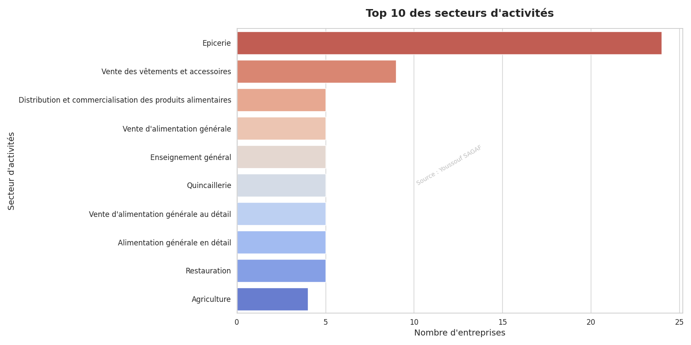
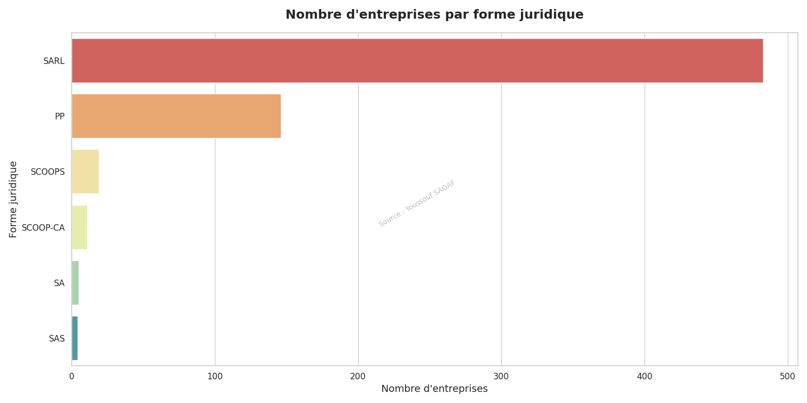
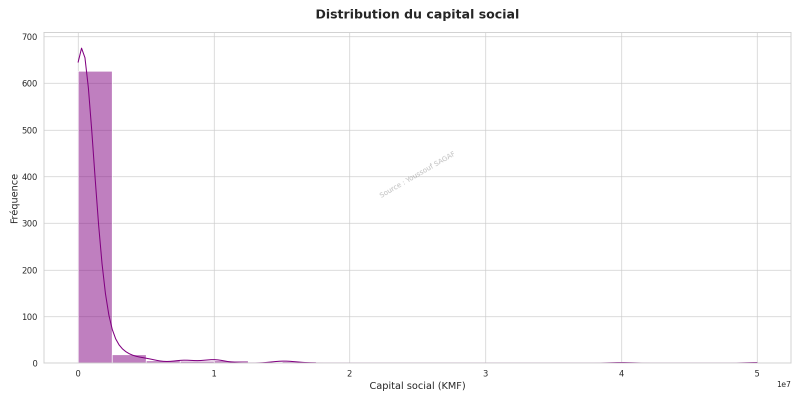
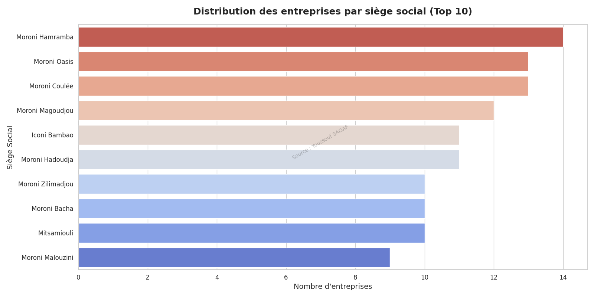

# Étude d'analyse des entreprises comoriennes à Moroni

## Description du projet

Ce projet contient une étude d'analyse des entreprises comoriennes basées principalement dans la capitale Moroni. L'analyse a été réalisée à l'aide des librairies Python Pandas, Seaborn et Matplotlib pour nettoyer les données, effectuer des statistiques descriptives et visualiser les résultats.

## Installation

Pour exécuter cette analyse sur votre système, vous devez installer les dépendances suivantes :

- Python: Ce projet nécessite Python 3.x.
- Pandas: Une librairie pour la manipulation des données sous forme de DataFrames.
- Matplotlib: Une librairie pour la création de visualisations statiques, telles que des graphiques.
- Seaborn: Une librairie basée sur Matplotlib pour la création de visualisations statistiques plus esthétiques.

Vous pouvez installer les dépendances à l'aide de la commande suivante : `pip install pandas matplotlib seaborn`

## Contenu du répertoire

Le répertoire est structuré comme suit :

- com-entreprises: Ce répertoire contient le code source de l'analyse.
    - com_analyze.ipynb: Le fichier Jupyter Notebook contenant le code de l'analyse.
    - com_analyze.py: Le script Python correspondant au Jupyter Notebook.
    - entreprises-2022.xlsx: Le jeu de données initial provenant du site web de l'ANPI Comores.
    - pycache: Le répertoire contenant des fichiers en cache générés par Python.
    - utils.py: Un module Python contenant des fonctions utilitaires pour l'analyse.
- Figures: Ce répertoire contient les graphiques générés lors de l'analyse.

- README.md: Ce fichier, qui décrit le projet et son contenu.

## Objectifs de l'analyse

L'objectif de cette analyse est de fournir des insights sur les entreprises comoriennes opérant à Moroni. Les principaux aspects étudiés sont :

- La distribution des entreprises par siège social
- La répartition des entreprises par secteur d'activité
- La répartition des entreprises par forme juridique
- L'analyse du capital social des entreprises

## Affichage des graphiques

Description des graphiques générés lors de l'analyse :

1. **Figure_1.png**: Nombre d'entreprise par secteur d'activités.
    

2. **Figure_2.png**: 
Nombre d'entreprises par forme juridiques.
    

3. **Figure_3.png**: Distribution du capital social.
   

4. **Figure_4.png**: Distribution des entreprises par siège social.
   

## Utilisation du code

Une fois les dépendances installées, vous pouvez ouvrir le fichier Jupyter Notebook `com_analyze.ipynb` pour accéder au code et aux visualisations générées.

## Remarque importante

Il est essentiel de noter que cette étude se concentre principalement sur les entreprises basées dans la capitale Moroni. Il peut y avoir un biais en raison du manque de données pour les entreprises situées dans les villages et d'autres régions en dehors de Moroni.

## Contribution

Toute contribution visant à améliorer cette analyse est la bienvenue ! Si vous souhaitez apporter des modifications ou soumettre des suggestions, veuillez ouvrir une pull request.

## Auteur

Ce projet a été réalisé par `yosagaf`. Vous pouvez me contacter à `youssouf.sagaf@vizionyd.fr` pour toute question ou commentaire.
